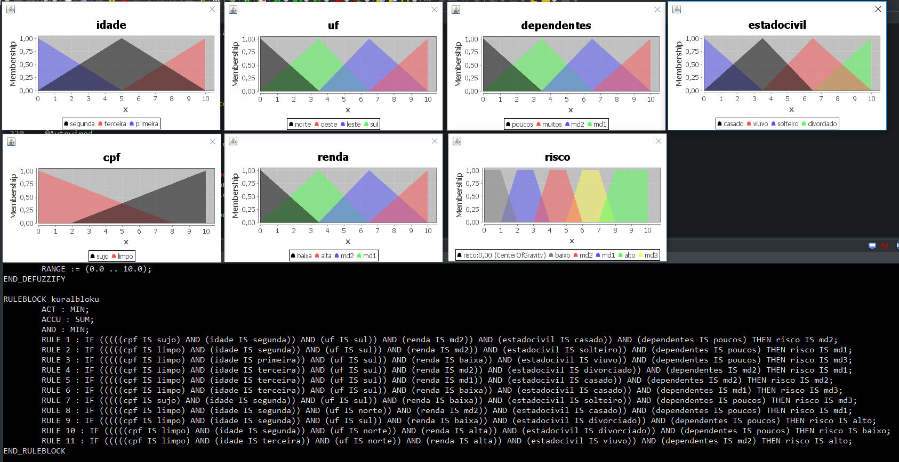
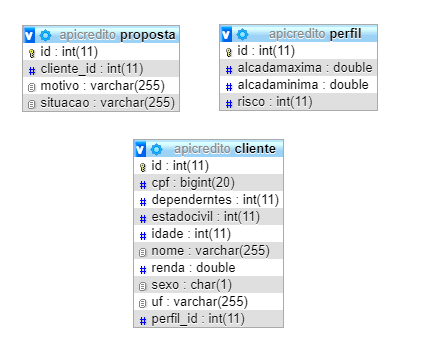

## API

### api-credt 1.0.0

##### Alguns Recursos Utilizados.
```
Spring boot
Spring data jpa
jFuzzyLogic
```
##### O Fluxo principal do sistema
```
1. Usuário : cadastra novo cliente
2. Sistema : avalia novo cliente e atribui um perfil
3. Sistema : avalia o perfil do cliente e gera uma proposta
4. Usuário : consulta proposta por meio do cliente
```
##### A utilização de jFuzzyLogic permite maior capacidade de análise otendo precisão na tomada de decisão
```
A base de regras foi desenvolvida apenas para demonstração compreendendo apenas 11 regras mas para alcançar 
um nível de certeza seria necessária utilização de no minimo 370 regras distintas.

OBS: toda lógica envolvida na avaliação está disponível no pacote com.zallpy.credit.fuzzy e o arquivo fis contem as regras desenvolvidas no MATLAB.

Para visualizar os gráficos das regras envolvidas no processo basta executar:

java -jar jFuzzyLogic.jar Aircon.fcl 

```
No diretório "com.zallpy.credit.fuzzy" e o resultado deve se parecer com:
```


#### Os End-Points da api são 

##### GET
```
localhost:8180/cliente/{ID}
localhost:8180/perfil/cliente/{ID}
localhost:8180/perfil/{ID}
localhost:8180/proposta/{ID}
localhost:8180/proposta/cliente/{ID}
```
##### PUT
```
localhost:8180/perfil/edit
localhost:8180/cliente/edit
```
##### POST
```
localhost:8180/perfil/add
localhost:8180/cliente/add
```

#### ER



#### Construindo projeto com container docker

```
docker build -t rogeriofonseca/tomcat-server:1.0 . && docker run -p 8383:8080 — rm -it rogeriofonseca/tomcat-server:1.0
```
